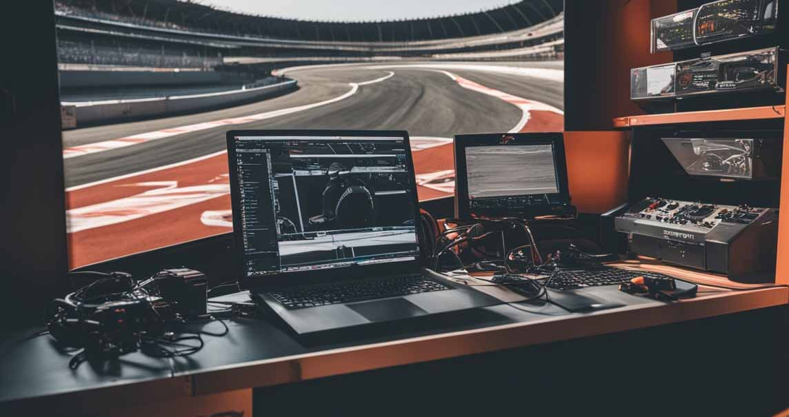

  

<h1 align="center">Hello, I'm Corentin !👋</h1>
<h2 align="center">I’m a 19-year-old engineering student at ISIMA in Clermont-Ferrand (France), with a deep-seated passion for computer science and motorsport. 🏎️</h2>

 
   

  <h2 align="left">About Me</h2>
    

      From a young age, I’ve been fascinated by cars and racing. I grew up following Formula 1 with my grandfather, and over the years, my enthusiasm has expanded to include WRC rallies, WEC races, and the legendary 24 Hours       of Le Mans, which I had the thrill of attending this year. My love for motorsport is matched by my commitment to IT, and I’ve set out to combine these two passions in my studies and future career.
    

   
  <h2 align="left">What I'm Working On</h2>
    

      Currently, I’m delving into :
     <ul>
      <li>
        Algorithmics: Focusing on algorithms, data structures, and automata theory.
      </li>
      <li>
        Graph Theory: Exploring applications and theoretical aspects of graphs.
      </li>
      <li>
        Object-Oriented Programming (OOP): Learning skills in implementation.
      </li>
      <li>
        Signal Processing: Investigating techniques and applications in this field.
      </li>
      <li>
        Maths: Linear Algebra and Analysis: Studying key concepts and their applications.
      </li>
     </ul>
    

 
  <h2 align="left">My Goals</h2>
  

        My passion for cars and motorsport has shaped my path and inspired me to blend this enthusiasm with my studies in computer science. From watching F1 races with my grandfather to attending major events like the 24 Hours of Le Mans, motorsport has always been central to my life. My objective is to work in a dynamic environment where I can contribute to the success of a racing team, constantly improve racing strategies, and work with cutting-edge technologies. I’m excited about the opportunity to combine my studies skills with my passion for motorsport to achieve both personal and professional growth.
  

  
 
  <h2 align="left">Let's Connect</h2>
    
I’m always open to discussing IT, motorsport, or potential career paths. Feel free to reach out to me for advice on my studies or for internships opportunities !

    

      
      
      
      
    

 
  <h2>Languages and Tools:</h2>
    

      
       
       
      
      
      
      
      
   

 
 
 
 

<i>Thank you for visiting my GitHub profile ! 🚗💨</i>

